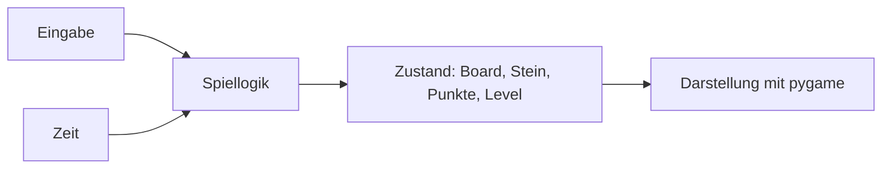

# Architektur: So ist Blockfall aufgebaut

Dieses Dokument beschreibt die geplante Architektur **konzeptionell**.
Es zeigt keinen vollständigen Lösungscode — den Weg dahin findest du
selbst im Kurs.

## Zuständigkeit der Dateien

| Datei | Aufgabe |
| ----- | ------- |
| `main.py` | Einstiegspunkt: Fenster, Eingabe, Zeichnen |
| `settings.py` | Zahlen, Farben und Einstellungen an einer Stelle |
| `tetromino.py` | Formen, Farben und Rotation der Steine |
| `board.py` | Spielfeld: Zellen, Kollision, volle Reihen |
| `game.py` | Spiellogik ohne Grafik: Fallen, Punkte, Zustände |
| `tests/` | Deine automatischen Tests |

## Trennung von Spiellogik und Darstellung

Die wichtigste Idee des Kurses:

- **Spiellogik** (`board.py`, `game.py`, `tetromino.py`) funktioniert
  ohne Fenster und ohne pygame — dadurch ist sie mit Tests prüfbar.
- **Darstellung** (`main.py`) zeigt den Zustand der Logik mit pygame.

Beide Seiten sprechen nur über klar definierte Werte (Zahlen, Listen,
Farben) miteinander. `game.py` kennt kein pygame.

## Datenmodell des Spielfelds

- Das Spielfeld ist ein Gitter aus 10 × 20 Zellen.
- Eine leere Zelle ist „leer" (`None`); eine belegte Zelle speichert
  die Farbe des fixierten Steins.
- Die oberste sichtbare Reihe ist Reihe 0; darunter wird es größer.
- Über dem Spielfeld ist alles frei — dort fallen neue Steine herein.

## Datenmodell der Tetrominos

- Jede Art wird als Form aus Zellen beschrieben (z. B. Zeichen in
  Zeilen).
- Ein aktiver Stein besteht aus Art, Farbe, Form und einer Position
  (x, y) auf dem Spielfeld.
- Die Zellen einer Form sind relativ zur Position (Versatz).

## Spielzustände

- **Läuft:** normaler Ablauf mit Eingabe und Schwerkraft.
- **Pause:** alles hält an, kein Fallen, keine Eingabe.
- **Game Over:** das Spiel ist zu Ende; Neustart möglich.

## Ereignisverarbeitung

- Die Hauptschleife holt regelmäßig alle Ereignisse ab.
- Tastendrücke werden erkannt und an die Spiellogik weitergereicht
  (bewegen, drehen, fallen lassen, pausieren, neu starten, beenden).

## Update-Phase

- Zeit wird gemessen; nach Ablauf der Fallzeit fällt der Stein ein Feld.
- Kann er nicht mehr fallen, wird er fixiert: seine Zellen werden mit
  seiner Farbe ins Spielfeld eingetragen.
- Volle Reihen werden entfernt, Punkte und Level aktualisiert.
- Danach wird der nächste Stein aktiv.

## Zeichenphase

Jedes Bild wird komplett neu gezeichnet:

1. Hintergrund,
2. belegte Zellen des Spielfelds,
3. der aktive Stein,
4. Gitterlinien,
5. Seitenbereich (Punkte, Level, Reihen, Vorschau, Hinweise),
6. gegebenenfalls Pause- oder Game-Over-Text.

## Datenfluss im Überblick

